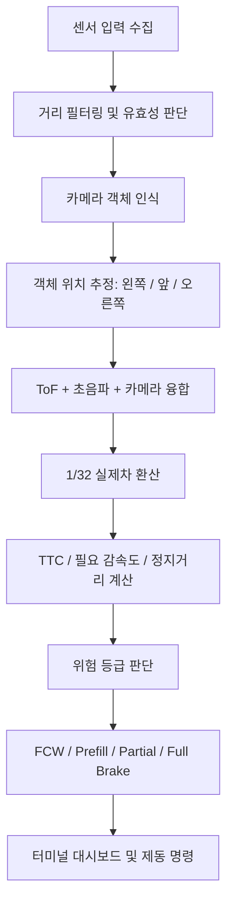

# 1/32 Scale Production-Like AEB System

## 프로젝트 한 줄 소개

이 프로젝트는 RC카 플랫폼 위에서 **실제 차량 AEB(Autonomous Emergency Braking, 자율 긴급 제동)의 판단 흐름**을 1/32 스케일로 축소 구현한 자율주행 긴급 제동 시스템입니다.

단순히 "앞에 물체가 가까우면 멈춘다"가 아니라, 카메라 객체 인식, 전방 ToF 거리, 좌우 대각 초음파 거리, 자차 속도, 예상 주행 경로, TTC, 필요 감속도, 정지 가능 거리를 함께 계산해서 **경고, 제동 준비, 부분 제동, 긴급 제동**을 단계적으로 판단합니다.

## 핵심 차별점

- **실제차형 판단 구조**: 거리 하나만 보는 방식이 아니라 TTC, 필요 감속도, 정지거리 기반으로 판단합니다.
- **1/32 스케일 모델**: 실제차 기준 거리와 속도를 RC카 환경에 맞게 1/32로 축소했습니다.
- **멀티 센서 융합**: 전방 ToF, 좌우 초음파, USB 카메라 객체 인식을 함께 사용합니다.
- **객체 종류와 위치 판단**: 사람, 자전거, 차량, 오토바이, 버스, 트럭을 인식하고 왼쪽/앞/오른쪽 위치로 분류합니다.
- **저속/정지 오작동 방지**: 내 차가 정지 중이면 장애물이 다가와도 제동으로 해결할 상황이 아니므로 AEB 제동을 걸지 않습니다.
- **비동기 YOLO 처리**: 객체 인식이 느려져도 ToF/초음파 기반 AEB 루프는 계속 동작합니다.
- **발표용 대시보드**: 센서 거리, 객체 위치, 실제차 환산 속도, 위험 수준, 판단 근거, 최종 제동 결과를 터미널에 실시간 표시합니다.

## 시스템 구성

| 구분 | 센서/모듈 | 역할 |
| --- | --- | --- |
| 전방 거리 | ToF 센서(I2C) | 정면 장애물까지의 직접 거리 측정 |
| 좌측 근접 | 좌측 전방 대각 초음파 | 좌측 전방 대각선 근접 장애물 감지 |
| 우측 근접 | 우측 전방 대각 초음파 | 우측 전방 대각선 근접 장애물 감지 |
| 객체 인식 | USB 카메라 + YOLO | 객체 종류, 위치, 경로 진입 가능성 판단 |
| 제어부 | Raspberry Pi 4 | 센서 융합, 위험 판단, AEB 상태 결정 |

## 전체 동작 프로세스



## 1/32 실제차 환산 모델

이 프로젝트는 RC카에서 동작하지만, 판단은 실제차 기준으로 먼저 계산합니다. 그 뒤 결과를 1/32 스케일로 축소해 RC카에 적용합니다.

```text
실제차 환산 거리 = RC카 실제 거리 * 32
실제차 환산 속도 = RC카 실제 속도 * 32
RC카 적용 정지거리 = 실제차 정지거리 / 32
```

예를 들어 대시보드에 아래처럼 표시되면:

```text
Speed : 32.0 km/h real-eq
Scale : 1/32 distance model
```

이는 RC카가 실제로 32km/h로 달린다는 뜻이 아니라, **실제차 32km/h 상황을 1/32 축소 모델로 시뮬레이션 중**이라는 뜻입니다.

## AEB 판단에 쓰는 물리식

### 1. 정지거리

```text
실제차 정지거리 =
현재 속도 * 시스템 지연시간
+ 현재 속도^2 / (2 * 최대 감속도)
+ 안전 여유거리
```

현재 모델 값:

```text
스케일              = 1/32
실제차 최대 감속도  = 7.85 m/s^2, 약 0.8g
시스템 지연시간     = 0.35 s
실제차 안전 여유    = 1.00 m
```

### 2. TTC(Time To Collision)

```text
TTC = 장애물 거리 / 제동으로 줄일 수 있는 접근속도
```

여기서 접근속도는 단순히 센서 거리값이 줄어드는 속도가 아닙니다. AEB는 내 차의 제동으로 줄일 수 있는 위험만 다뤄야 하므로 아래처럼 제한합니다.

```text
제동용 접근속도 = min(센서 접근속도, 내 차 속도)
```

즉, **내 차가 정지 중인데 장애물이 센서 쪽으로 다가오는 상황은 AEB 제동 대상이 아닙니다.**

## 판단 기준

### 속도 조건

실제차 환산 기준으로 약 10km/h 이상일 때 AEB 제동 판단을 활성화합니다. 이 기준은 공개 안전기준의 저속 작동 범위와 맞추기 위한 하한값입니다.

```text
실제차 환산 속도 < 10km/h -> AEB 제동 판단 차단
실제차 환산 속도 >= 10km/h -> TTC/감속도/정지거리 판단
```

### TTC 기준

| 단계 | 기준 |
| --- | --- |
| FCW 경고 | TTC <= 2.00초 |
| 부분 제동 | TTC <= 1.20초 |
| 긴급 제동 | TTC <= 0.60초 |

### 필요 감속도 기준

| 단계 | 기준 |
| --- | --- |
| FCW 경고 | 필요 감속 >= 2.0 m/s^2 |
| 브레이크 준비 | 필요 감속 >= 3.0 m/s^2 |
| 부분 제동 | 필요 감속 >= 4.5 m/s^2 |
| 긴급 제동 | 필요 감속 >= 7.0 m/s^2 |

### 근접 장애물 기준

| 항목 | 실제차 기준 | 1/32 RC 기준 |
| --- | ---: | ---: |
| 전방 긴급 근접 | 4.0 m | 12.5 cm |
| 좌우 대각 FCW | 2.0 m | 6.25 cm |
| 좌우 대각 부분 제동 | 1.2 m | 3.75 cm |
| 좌우 대각 긴급 제동 | 0.8 m | 2.5 cm |

## AEB 상태 단계

| 상태 | 의미 |
| --- | --- |
| MONITORING | 정상 감시 중 |
| FCW | Forward Collision Warning, 전방 충돌 경고 |
| BRAKE_PREFILL | 브레이크 준비 단계 |
| PARTIAL_BRAKE | 부분 제동 |
| FULL_BRAKE | 긴급 제동 |
| STOP_HOLD | 정지 유지 |
| DEGRADED | 일부 센서 제한 상태 |
| SENSOR_FAULT | 센서 고장 또는 입력 불가 |
| RELEASE | 제동 해제 |

## 센서별 역할

### 전방 ToF

전방 중앙 장애물까지의 실제 거리를 직접 측정합니다. 카메라가 객체를 놓쳐도 전방에 가까운 장애물이 있으면 ToF만으로도 AEB 판단에 들어갈 수 있습니다.

### 좌우 대각 초음파

차량 전방 좌우 사각 영역의 근접 물체를 감지합니다. 단독 메인 센서라기보다, 카메라와 ToF가 놓칠 수 있는 좌우 근접 위험을 보조하는 역할입니다.

### USB 카메라 + YOLO

객체의 종류와 화면상 위치를 판단합니다. 현재 탐지 대상은 다음과 같습니다.

```text
person, bicycle, car, motorcycle, bus, truck
```

카메라 추론은 Raspberry Pi에서 무겁기 때문에 비동기로 처리합니다. YOLO가 느려져도 ToF와 초음파 기반 긴급 판단 루프는 계속 유지됩니다.

## 센서 융합 방식

이 시스템은 센서 하나만 믿지 않습니다.

- 전방 중앙 객체: 카메라 위치 추정 + ToF 거리 융합
- 좌우 대각 객체: 카메라 위치 추정 + 초음파 거리 융합
- 객체 인식 실패 시: ToF/초음파 기반 unknown close obstacle 판단
- 센서 일부 실패 시: DEGRADED 모드로 전환해 가능한 센서만 사용
- 센서 전체 불량 시: SENSOR_FAULT로 안전 상태 표시

## 발표용 핵심 멘트

> 저희 AEB는 단순히 거리가 가까우면 멈추는 장치가 아닙니다. 전방 객체가 실제 주행 경로 안에 있는지, 현재 속도에서 충돌까지 몇 초가 남았는지, 충돌 회피에 필요한 감속도가 차량 제동 한계 안에 있는지를 계산합니다. 그 결과에 따라 경고, 제동 준비, 부분 제동, 긴급 제동으로 단계적으로 동작합니다.

> 실제 양산차의 AEB 내부 판단 맵은 제조사 비공개이기 때문에 그대로 복제할 수 없습니다. 대신 NHTSA FMVSS No. 127과 Euro NCAP의 AEB/VRU 평가 개념을 참고하고, TTC, 필요 감속도, 정지거리 기반의 물리 모델을 적용했습니다. 이후 거리와 속도를 1/32로 축소해 RC카 환경에서 실제차형 판단 흐름을 시연하도록 구현했습니다.

> 특히 내 차가 정지 중이면 장애물이 가까워져도 제동으로 해결할 수 있는 상황이 아니므로 AEB를 작동시키지 않습니다. 이는 센서값만 보는 단순 로직이 아니라, 자차 속도와 제동 가능성을 함께 고려하는 실제차형 판단 구조입니다.

## 실행 방법

```bash
python3 aeb.py
```

키보드 조작:

```text
UP/DOWN       실제차 환산 속도 증가/감소
LEFT/RIGHT    조향 방향 변경
S             조향 중앙 복귀
O             운전자 오버라이드
Q             종료
```

## ToF 배선

전방 ToF 센서는 I2C 모드로 사용합니다.

| ToF 핀 | Raspberry Pi 연결 |
| --- | --- |
| VIN | 3.3V 또는 센서 정격 VIN |
| GND | GND |
| SCL | GPIO 3, SCL1, 물리 핀 5 |
| SOA/SDA | GPIO 2, SDA1, 물리 핀 3 |
| GPIO1 | 미연결 |
| XSHUT | 미연결, 시작 불량 시 VIN으로 pull-up |

## 공식 참고 자료

- NHTSA / Federal Register, FMVSS No. 127 final rule:
  https://www.federalregister.gov/documents/2024/05/09/2024-09500/federal-motor-vehicle-safety-standards-automatic-emergency-braking-systems-for-light-vehicles
- Euro NCAP Safety Assist:
  https://www.euroncap.com/en/vehicle-safety/the-ratings-explained/safety-assist/
- Euro NCAP Vulnerable Road User Protection:
  https://www.euroncap.com/en/vehicle-safety/the-ratings-explained/vulnerable-road-user-vru-protection/

## 안전 고지

이 프로젝트는 교육용 RC카/저속 테스트 벤치용입니다. 실제 차량 제동계에 직접 연결하거나 실제 도로 환경에서 사용해서는 안 됩니다. 실제 차량 수준의 안전 인증, 이중화, 기능 안전(ISO 26262), 환경 검증은 포함하지 않습니다.
